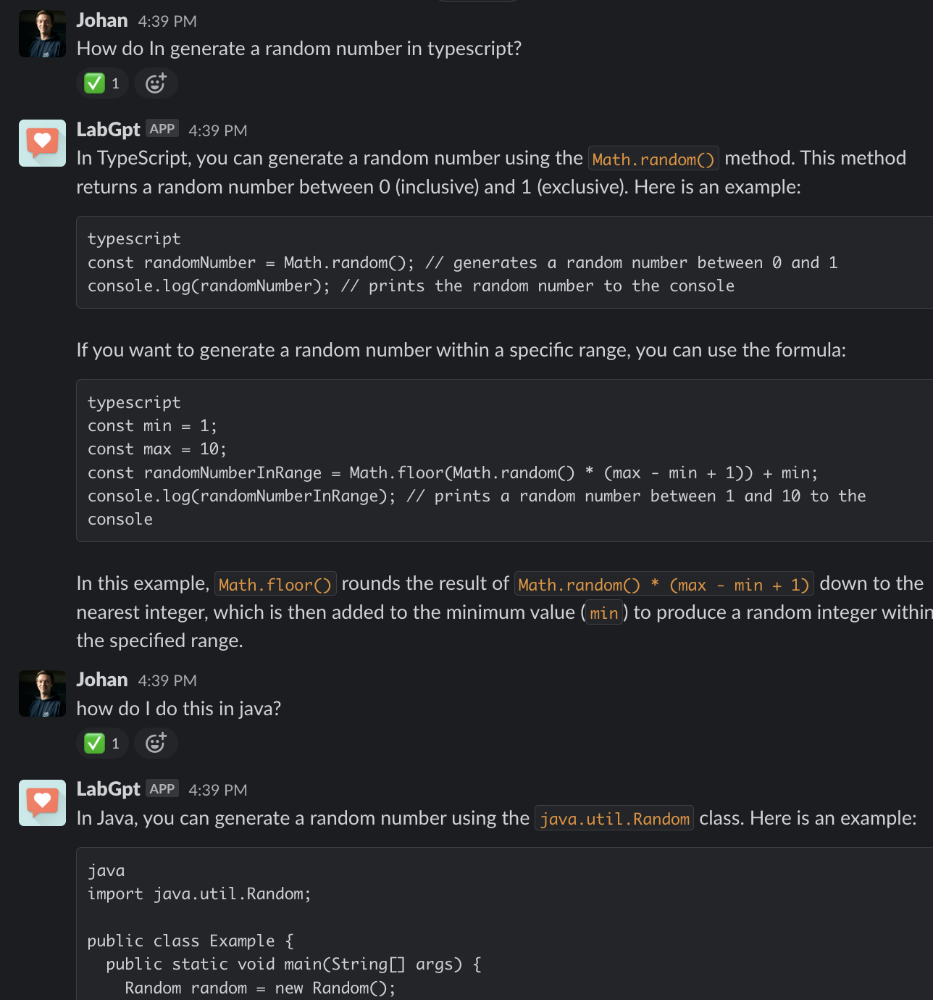
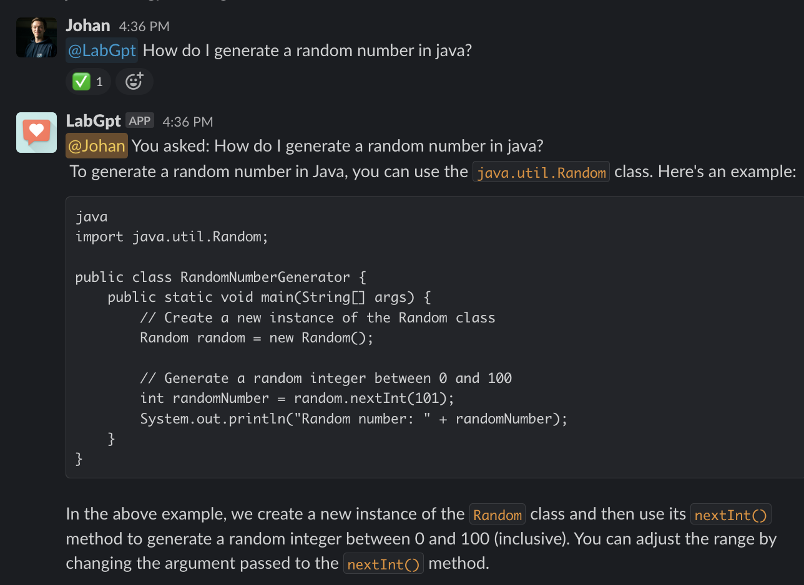

ChatGPT for Slack
---

Start an API service for interacting with ChatGPT on Slack.
This app uses the library at https://github.com/transitive-bullshit/chatgpt-api


You can: 
  - Chat with the bot directly
  - Mention the bot in a channel or thread & as long as you keep mentioning it, continue the conversation 

The conversation will end automatically after 30 minutes or when you type "end", "stop" or "close"

## Setup
### Register for an OpenAI API Key
Sign up at https://platform.openai.com/overview and create a new API key in https://platform.openai.com/account/api-keys

### Setup Slack App
Check this for the guide how to create a Slack App https://slack.dev/bolt-js/tutorial/getting-started

And you need these keys for the next step
```
SLACK_SIGNING_SECRET=""
SLACK_BOT_TOKEN=""
SLACK_APP_TOKEN=""
```
In "Basic Information", create an app token and store in SLACK_APP_TOKEN

```
App-Level Token:

connections:write
authorizations:read
app_configurations:write
```

Here you can also find the "Signing Secret" to store in SLACK_SIGNING_SECRET

In "App Home", check this checkbox:

```
Allow users to send Slash commands and messages from the messages tab
```

In "Socket Mode", enable socket mode

In "OAuth & Permission", add these scopes to Bot Token Scopes

```
app_mentions:read
channels:join
chat:write
chat:write.customize
chat:write.public
im:history
im:read
im:write
```
Then click "install in workspace" and copy the "Bot User OAuth Access Token" to SLACK_BOT_TOKEN

In "Event Subscriptions", add two subscriptions:
```
app_mention
message.im
```

### Setup your app
- Require nodejs >= 18 (required by above library)
- Create new `.env` and update the information
```
cp .env.sample .env
# Open file `.env` and filling all the keys
```
- Install
```
yarn install
```

- Start the service
```
yarn start
```

Note: It will open the Chrome browser, and you have to manually do the CAPTCHA
Or you can use refer to this page to automatically by pass the CAPTCHA https://github.com/transitive-bullshit/chatgpt-api/blob/v3.3.0/readme.md#captchas

## Usage
- You can send a direct message to the Slack Bot



- Or invite it to a channel and mention it `@YourSlackBot <your question>`



- Note:
  - To reset thread, simply type `close` or `stop`